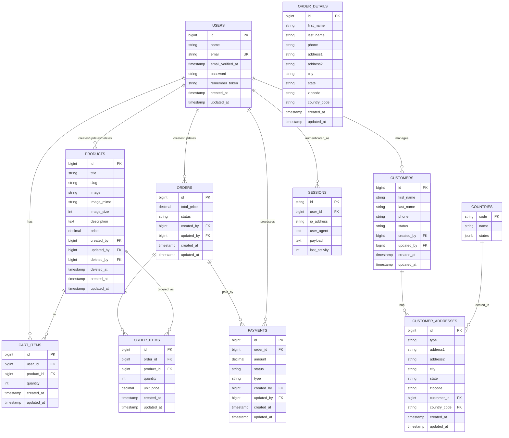

```mermaid
erDiagram
    USERS {
        bigint id PK
        string name
        string email UK
        timestamp email_verified_at
        string password
        string remember_token
        timestamp created_at
        timestamp updated_at
    }

    PRODUCTS {
        bigint id PK
        string title
        string slug
        string image
        string image_mime
        int image_size
        text description
        decimal price
        bigint created_by FK
        bigint updated_by FK
        bigint deleted_by FK
        timestamp deleted_at
        timestamp created_at
        timestamp updated_at
    }

    CART_ITEMS {
        bigint id PK
        bigint user_id FK
        bigint product_id FK
        int quantity
        timestamp created_at
        timestamp updated_at
    }

    ORDERS {
        bigint id PK
        decimal total_price
        string status
        bigint created_by FK
        bigint updated_by FK
        timestamp created_at
        timestamp updated_at
    }

    ORDER_DETAILS {
        bigint id PK
        string first_name
        string last_name
        string phone
        string address1
        string address2
        string city
        string state
        string zipcode
        string country_code
        timestamp created_at
        timestamp updated_at
    }

    ORDER_ITEMS {
        bigint id PK
        bigint order_id FK
        bigint product_id FK
        int quantity
        decimal unit_price
        timestamp created_at
        timestamp updated_at
    }

    PAYMENTS {
        bigint id PK
        bigint order_id FK
        decimal amount
        string status
        string type
        bigint created_by FK
        bigint updated_by FK
        timestamp created_at
        timestamp updated_at
    }

    CUSTOMERS {
        bigint id PK
        string first_name
        string last_name
        string phone
        string status
        bigint created_by FK
        bigint updated_by FK
        timestamp created_at
        timestamp updated_at
    }

    CUSTOMER_ADDRESSES {
        bigint id PK
        string type
        string address1
        string address2
        string city
        string state
        string zipcode
        bigint customer_id FK
        string country_code FK
        timestamp created_at
        timestamp updated_at
    }

    COUNTRIES {
        string code PK
        string name
        jsonb states
    }

    SESSIONS {
        string id PK
        bigint user_id FK
        string ip_address
        text user_agent
        text payload
        int last_activity
    }

    %% Relationships
    USERS ||--o{ PRODUCTS : "creates/updates/deletes"
    USERS ||--o{ CART_ITEMS : "has"
    PRODUCTS ||--o{ CART_ITEMS : "in"
    
    USERS ||--o{ ORDERS : "creates/updates"
    ORDERS ||--o{ ORDER_ITEMS : "contains"
    PRODUCTS ||--o{ ORDER_ITEMS : "ordered_as"
    
    ORDERS ||--o{ PAYMENTS : "paid_by"
    USERS ||--o{ PAYMENTS : "processes"
    
    USERS ||--o{ CUSTOMERS : "manages"
    CUSTOMERS ||--o{ CUSTOMER_ADDRESSES : "has"
    COUNTRIES ||--o{ CUSTOMER_ADDRESSES : "located_in"
    
    USERS ||--o{ SESSIONS : "authenticated_as"
```
